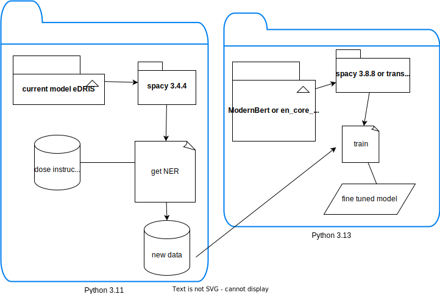

# **Project**
This Python project contains simple pipelines to create a NER application - November 2025. It contains subfolders with separate virtual environment creation and their own required packages. Keep in mind these considerations:

- You only need to create your Python venv once (each subfolder has one). The same about installed packages unless you want to update any of them
- Every time you want to run each subproject section you make sure the virtual env is activated

| Subproject/subfolder | Python | More info                                                      |
|----------------------|--------|----------------------------------------------------------------|
| demo_spacy           | 3.13.x | [View demo_spacy README](./demo_spacy/README.md)               |
| demo_med7            | 3.11.x | [View demo_med7 README](./demo_med7/README.md)                 |
| demo_transformers    | 3.13.x | [View demo_transformers README](./demo_transformers/README.md) |
| demo_label           | 3.12.x | [View demo_label README](./demo_label/README.md)               |

## Some internal data
- Ask the project manager for internal data files. They are in .dat extension. Copy them in data folder.

## Proposal workflow diagram

## Some external data for fine tunning

[data sample for fine tunning](https://universe.roboflow.com/fast-nuces-xcmbn/prescription-labeling/dataset/3#)

- Download this data to your session using the command: `curl -L "https://universe.roboflow.com/ds/dsYQAnDdyu?key=Hx3NcG9JDD" > roboflow.zip`
- unzip the file using: `unzip roboflow.zip`
- delete the zip file: `rm roboflow.zip`

## Resource

- [How to use VS code in Posit Workbench](https://github.com/Public-Health-Scotland/vscode_prep)

- [Fine tune models](https://huggingface.co/Simonlee711/Clinical_ModernBERT)

- [Models from Google](https://huggingface.co/google-bert)

- [Models from Meta](https://huggingface.co/FacebookAI)

- [Label studio tool for data labeling](https://labelstud.io/)

- [Train with spacy](https://medium.com/@johnidouglasmarangon/train-a-custom-named-entity-recognition-with-spacy-v3-ea48dfce67a5)
