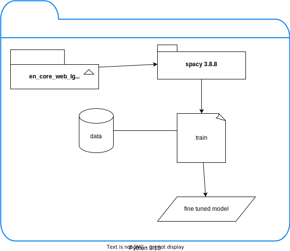

# spacy NER
- Create a Python 3.13 venv: `python -m venv demo_spacy/.venvspac`
- Activate this venv: `source demo_spacy/.venvspac/bin/activate`
- Update your venv pip: `pip install --upgrade pip`
- Install wheel package to speed up package installation: `pip install wheel`
- install packages from requirements.txt which is part of this subfolder: `pip install -r demo_spacy/requirements.txt --prefer-binary`
- Run download_models.py to download some models: `python download_models.py`
- Or you can install a model with this command: `python -m spacy download en_core_web_sm`
- Run test_demo_spacy.py: `python test_demo_spacy.py`
- You will be able to see some values in terminal related to amounts. (e.g. 100mg 500mg)

## Available models

| name           | specification                                                             |
|----------------|---------------------------------------------------------------------------|
| en_core_web_sm | Small model optimized for CPU, suitable for basic tasks                   |
| en_core_web_md | Medium model with word vectors, suitable for more complex tasks           |
| en_core_web_lg | Large model with extensive word vectors, suitable for high accuracy tasks |

## Train your model
- If you train spacy with your own data you can create your own package using: python -m spacy package ./ner_dose_model ./dose_ner --name dose_ner_test --version 1.0.0
- These packages are important to create your executable whl: `pip install build twine`
- Navigate to the directory where your model package is (e.g., ./output/en_my_model-1.0.0) and run: `python -m build`
- Use twine to upload your package: `twine upload dist/*`

## Considerations
- Spacy 3.8.8 is currently compatible with Python 3.13.x (Nov 2025).

## Diagram

## Resources

- [Spacy Language support](https://spacy.io/usage/models#languages)

- [Spacy CLI Documentation](https://spacy.io/api/cli)

- [Spacy Visualizer](https://spacy.io/usage/visualizers)
