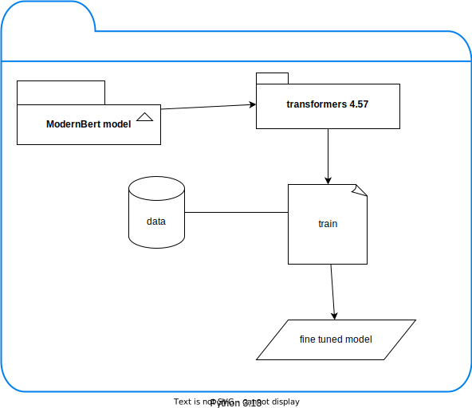

# transformers NER
- Create a Python 3.13 venv: `python -m venv demo_transformers/.venvtrans`
- Activate this venv: `source demo_transformers/.venvtrans/bin/activate`
- Update your venv pip: `pip install --upgrade pip`
- Install wheel package to speed up package installation: `pip install wheel`
- Install packages from requirements.txt which is part of this subfolder: `pip install -r demo_transformers/requirements.txt --prefer-binary`
- Run the following examples:

| Model               | command                                               | description                                  |
|---------------------|-------------------------------------------------------|----------------------------------------------|
| Bert                | `python demo_transformers/test_bert.py`               | General model from Google                    |
| RoBerta             | `python demo_transformers/test_roberta.py`            | General model from Google                    |
| DistilBert          | `python demo_transformers/test_dsbert.py`             | Variation model                              |
| ModernBert          | `python demo_transformers/test_modernbert.py`         | Geneeral model, the most updated from Google |
| biomed              | `python demo_transformers/test_biomed.py`             | Customised model for medical NER             |
| Clinical_ModernBERT | `python demo_transformers/test_clinicalmodernbert.py` | Customised model for medical NER             |

- You will see the results in tereminal. Some detected words related to a medical prescription paragraph (Python variable text)
- These models can also work with sentiment analysis, question answering, and text classification:

### Note

- If you want to fine tune a model you need to consider a base model which is frequently being updated
- test scripts are under development.

## Diagram

## Resources

- [Biomed](https://huggingface.co/d4data/biomedical-ner-all)

- [Clinical_ModernBERT](https://huggingface.co/Simonlee711/Clinical_ModernBERT)
